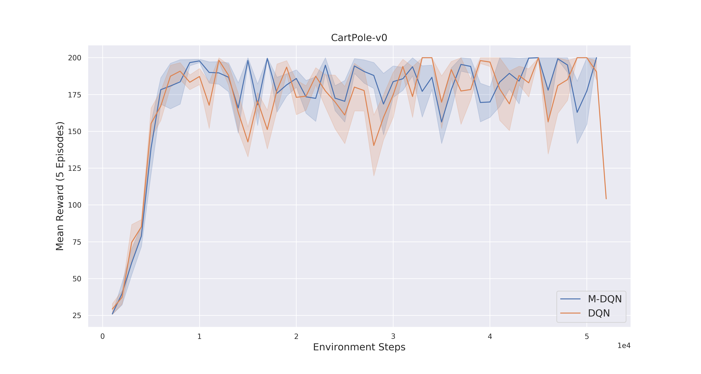
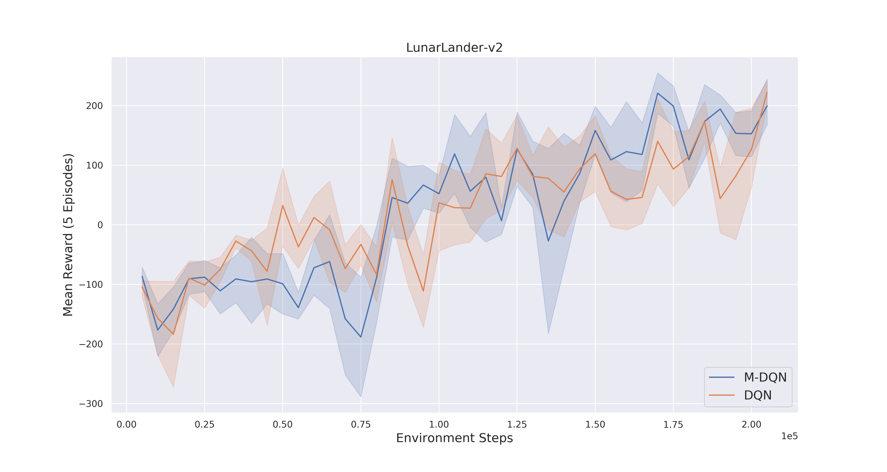

# Munchause-RL

PyTorch implementation of the M-DQN algorithm based on the paper [Munchause Reinforcement Learning](https://arxiv.org/abs/2007.14430).

For a short introduction check out the Medium [Article!](https://medium.com/@sebastian.dittert3692/munchausen-reinforcement-learning-9876efc829de?sk=885c4457cdd3d2d90a7adc5f8d574b7b)

#### Work in progress
Currently this repository only includes the base M-DQN implementation. The advanced distributional RL version M-IQN will follow 

# Results 
Comparison runs between M-DQN and DQN for the CartPole-v0 environment and LunarLander-v2.

