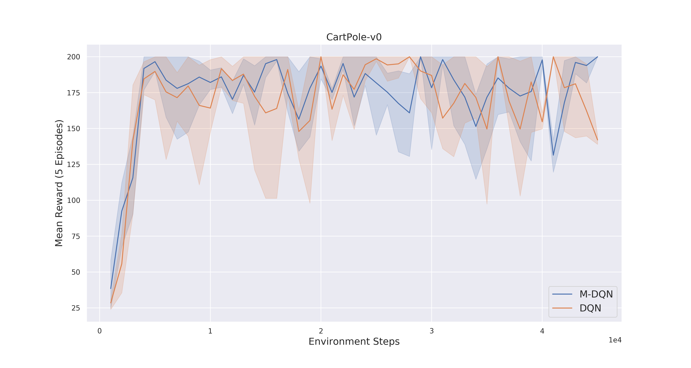

# Munchause-RL

PyTorch implementation of the M-DQN algorithm based on the paper [Munchause Reinforcement Learning](https://arxiv.org/abs/2007.14430).

For a short introduction check out the Medium [Article!](https://medium.com/@sebastian.dittert3692/munchausen-reinforcement-learning-9876efc829de?sk=885c4457cdd3d2d90a7adc5f8d574b7b)

## Implementations 
Discrete Action Space: 
- [M-DQN](https://github.com/BY571/Munchausen-RL/blob/master/M-DQN.ipynb)
- [M-IQN](https://github.com/BY571/IQN-and-Extensions)
- [M-FQF](https://github.com/BY571/FQF-and-Extensions)

Continuous Action Space: 
- [M-SAC](https://github.com/BY571/Soft-Actor-Critic-and-Extensions)

### Changes to the Paper
Compared to the original algorithm I did some changes:
1. Instead of doing a hard update every 8000 frames I implemented a soft-update. By personal experience this worked better. 

# Results 
Comparison runs between M-DQN and DQN for the CartPole-v0 environment and LunarLander-v2.

Comparison of IQN and M-IQN for LunarLander-v2

Comparison IQN and M-IQN for Breakout

